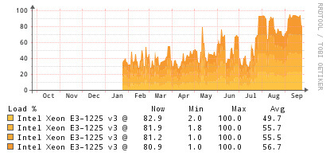
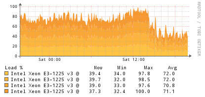

Naše cesta k nasazení Cassandry byla poměrně rychlá: šli jsme rovnou do produkce a problémy se učili řešit až za běhu. Za rok, co ji provozujeme, jsme potkali už téměř všechny běžné scénáře:

* přeplnění tombstone
* oživení tombstone kvuli nespuštění repair do konce gc_grace_period
* nekontrolovatelné spínání stop-the-world garbage collection
* neopravitelné rozpojení tabulky mezi datacentry
* smazání části databáze špatně napsanou čistící funkcí a následná obnova ze snapshotu ...

Poslední dobou jsem ale zaznamenal plynulý nárůst zátěže na serverech s Cassandrou. Nárůst, který jsem si nedovedl vysvětlit.

Nejdříve jsem jej chtěl přisuzovat zvyšujícímu se objemu přenosu. Přece jen každý měsíc přidáváme nové stroje na těžbu a zpracování dat, logicky by se měla zvednout i zátěž na databázi. Svědomitě jsem proto pravidelně pouštěl repair, hlídal četnost GC a dodržoval postupy, které jsme našli v literatuře. A právě tady byl problém.

Bohužel jsme šáhli po stejných zdrojích jako [Maki Watanabe](http://mail-archives.apache.org/mod_mbox/cassandra-user/201104.mbox/%3CBANLkTikbKi56=ZyxvXCC-dJxLteNJGyt6w@mail.gmail.com%3E). Důvod nárustu se ukázal být úplně prostý - nodetool repair implicitně nespouští tzv. major compaction. Právě nodetool compact jsem přestal manuálně spouštět ve chvíli, kdy jsem se naučil používat nodetool repair.

Repair není tak efektivní v odstraňování tombstone a my často zapisujeme, mažeme a provádíme změny struktury naší databáze. To také vedlo k vyšší zátěži.

**Vývoj zátěže CPU na apollo.webmedea.com od nasazení serveru.**

**Zátěž CPU po vynucené kompakci.**

Všechno špatné je ale k něčemu dobré, máme poučení, že nemáme číst zastaralou literaturu. Známe teď také další problémový scénář :)
