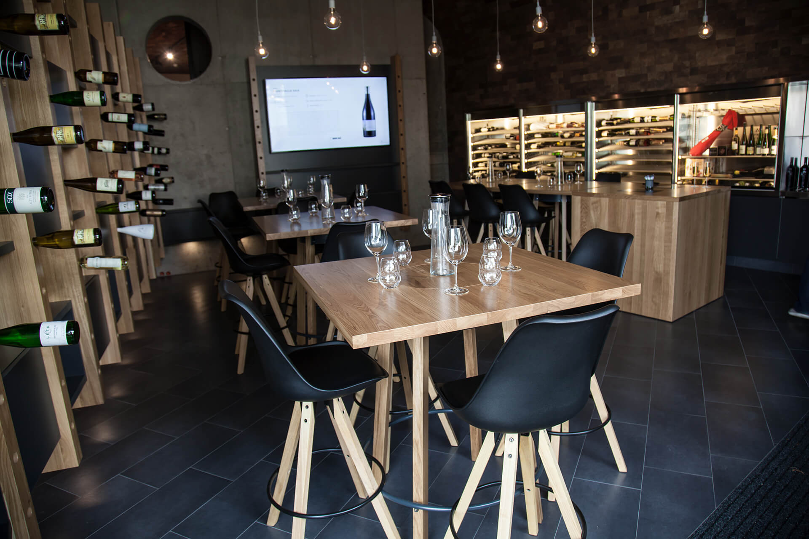

Protože jsem chtěl poznat Pražskou vinárnu [Wine Bar](https://www.winebar.cz) i z druhé strany - jako zákazník, a porozumět tak více vínům, rozhodl jsem se navštívit degustaci vín, která se ve vinárně pravidelně koná. 

Degustace se tentokrát zaměřovala na vína oceněná českou soutěží Prague Wine Trophy, kde nabídka Wine Baru získala hned několik medailí a dokonce i titul šampióna ve dvou kategoriích. Degustace byla super akce - přestože jsem naprostý laik, necítil jsem se méněcenně. Sommeliér Petr Mikeska vysvětloval i pojmy, které jsou pro zkušené samozřejmostí. Ochutnávka každého vína byla doplněna názornou prezentací fotografií, mapou lokality, odkud pochází hrozny, i zajímavostmi ze zákulisí vinařství.

Spodní patro vinárny Wine Bar
