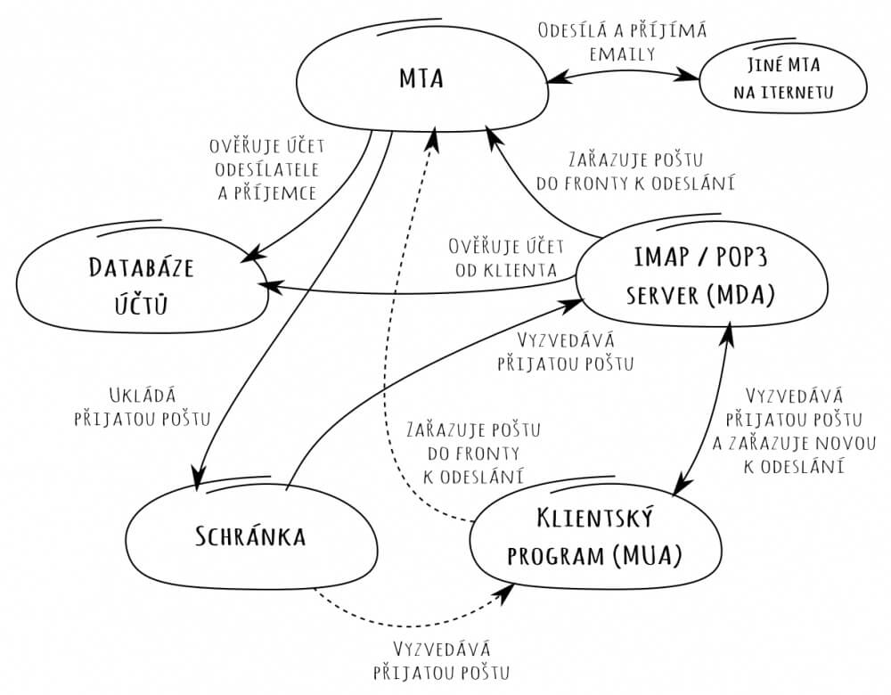

Po zjištění z [minulého dílu](/emaily-na-vlastni-domene-dil-1) jsme se v Triton IT rozhodli nasadit vlastní mail server. Z běžně používaných řešení je ale pouze Microsoft Exchange Server dostupný jako kompetní balík všeho, co je potřeba. MS Exchange Server samozřejmě představuje nemalou investici a funguje jen na zařízeních s operačním systémem Windows Server. Vzhledem k našim požadavkům na nízkou cenu nezbývá, než ho přeskočit a podívat se na celé téma podrobněji.

Pro úspěšný běh vlastního mail serveru na internetu je potřeba *jen* následující tři kusy software:

* **MTA:** Mail Transfer Agent vyměňuje emaily po internetu. Funguje jako server i klient nad protokolem SMTP. Příkladem MTA jsou programy sendmail, postfix a exim4. V podstatě má jen dva úkoly:
    * jako klient se připojí k jinému MTA a doručí mu email.
    * jako server čeká, až mu někdo (např. jiný MTA) doručí email. Pak se rozhodne, jestli ho někam uloží, nebo ho jde poslat dál.
* **MDA:** Mail Delivery Agent umožňuje uživatelům stahovat emaily ze serveru. Konkrétně povoluje klientským programům (MUA) se připojit prostřednictvím protokolů IMAP nebo POP3 ke schránkám uživatelů. Teoreticky také může schránky a uživatele spravovat, to je něco, co ale umí i někteří MTA a obecně není jasně dáno, kdo to má mít starost.
* **MUA:** Mail User Agent je program, s kterým pracuje uživatel. MUA má zpravidla hezké grafické rozhraní s přehledem emailů ve schránce, ukládá si kontakty, umožňuje snadno přikládat přílohy, atd. Mezi MUA patří MS Outlook, Thunderbird, ale i GMail.com a Seznam.cz.

Když si oddělíme databázi našich uživatelů a samotné úložiště schránek, jde to celé nakreslit asi takto:

Při návrhu se největším úskalím ukázalo být vyzvedávání emailů pomocí MUA z MDA. Přestože komunikace přes protokoly POP3 a IMAP je naprosto přímočará a jasně definovaná, některé MUA se rozhodly zavést si vlastní dodatečná pravidla k formátu uživatelských jmen a šifrování. Konkrétně:

* MS Outlook nefunguje, dokuď nemá uživatelská jména pro komunikaci s MDA jen v alfanumerickém tvaru, tj. bez symbolu @ (nelze použít email jako přihlašovací jméno).
* GMail protestuje, pokud TLS komunikace není realizována pomocí certifikátu od některé z mezinárodních certifikačních autorit. Certifikát od Let's encrypt v době našeho testování (2016) bohužel nebyl podporován.

## Finální řešení

Po dlouhém výzkumu metodou pokus-omyl jsme došli k následujícímu rozvržení:

* MTA = postfix
* MDA = dovecot
* MUA = co má kdo rád, za mě jednoznačně GMail
* Schránka = složka na serveru, kompletně v režii postfix a dovecot
* Databáze emailových účtů = MySQL databáze

Tím jsme dosáhli následujících nákladů:

* 110 Kč / měsíc ... Virtuální server, na kterém už stejně provozujeme weby
* 259 Kč / rok ... Certum Commercial SSL certifikát
* 130 Kč / rok / doména ... Náklady na CZ doménu placené registrátorovi

Jakých výhod jsme tímto řešením dosáhli?

* Libovolný počet domén, schránek, aliasů bez poplatků navíc.
* Možnost napojit oblíbenou schránku na webu nebo program úplně podle vlastní preference zaměstnance.
* Při používání GMailu dále:
    * Snadné spojení více firemních i soukromých schránek do jediného účtu
    * Automatické ukládání kontaktů a jejich sdílení do Android zařízení
* Téměř bezúdržbový běh
* Při použítí POP3 k vyzvedávání schránky - téměř nulové nároky místo při zálohování, zodpovědnost za uložené emaily lze přesunout na jinou (i placenou) službu.

V příštím díle se podíváme na běžné problémy, se kterými se setkáte po nasazení vlastního mail serveru. A že jich není málo.
