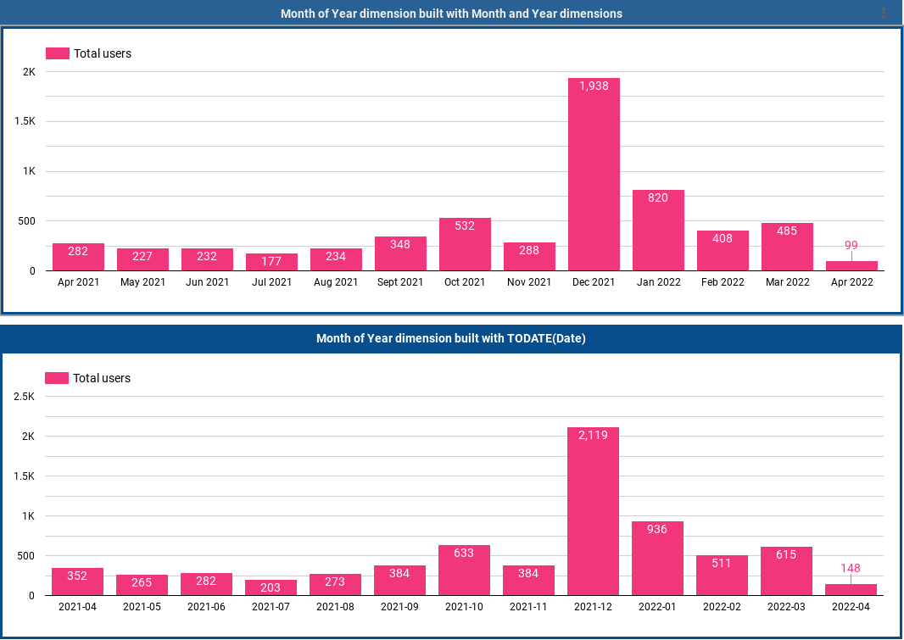

**2023-09-08 UPDATE**: It is no longer necessary to create custom **Month of Year** dimension. The new version of Google Data Studio (renamed to Looker Studio) now contains dimension called **Year month**. Additionally, my function is broken due to internal changes of **Year** dimension data formatting.

**Updated formula that works** - Credit to **[Manuel Garcia](http://facine.es/)**:

`PARSE_DATE('%Y-%m', CONCAT(SUBSTR(Year, 1, 4), '-', IF(Month < 10, CONCAT('0', Month), CAST(Month AS TEXT ) ) ) )`

## Original article text

To get **Month of Year** dimension it is not as simple as writing `TODATE(Date, '%Y-%m').`

It is a bad idea to use the above formula. Why? Because there are cases where it will behave incorrectly and you might snap your keyboard trying to figure out why doesn't your Google Data Studio dashboard show the same data as you can see in your Google Analytics account.

The problem comes from the source dimension used to build your **Month of Year** field. Since the source dimension is not based on **Month** but on a single day (**Date**), the data pulled from your Google Analytics will have different granularity.

This might not be a problem with metrics attached to a single event, however metrics over larger scopes that are less dependent on a single point in time will get distorted results.

The above image demonstrates the difference on the metric **Total users**. The top chart uses correctly prepared **Month of Year** dimension  and shows visitors corresponding to the numbers in Google Analytics. The lower chart uses incorrect **Month of Year** dimension that uses **Date** as source dimension and the number of visitors appears higher.

So what is the reason for this difference? It is simple: The source dimensions you use to build custom fields in Data studio dictate how will the data get collected from Google Analytics database. When you use **Date** as a base for your **Month of Year** dimension, the **Total users** metric will be exported for each day independently and only afterwards merged together to add up to the months. This is obviously a problem - some visitors might have visited your website on multiple days, however their visits are now added up as if they come from different visitors.

So how to build **Month of Year** correctly? You must stick only to **Year** and **Month** dimensions. Merge them into a single field. The following formula is my crude implementation.

`PARSE_DATE('%Y-%m', CONCAT(Year, '-', IF(Month < 10, CONCAT('0', Month), CAST(Month AS TEXT ) ) ) )`

The **Year** and **Month** dimensions are joined as a text and **Month** is zero padded when necessary (sadly there is no LPAD function in Data studio). Finally, the resulting text is converted back to Date format so Data studio can recognize this is a time-based field.

## Article changelog

- Updated bar chart image to corresponding time frames.
- Changed the correct dimension formula from compat. mode TODATE to PARSE_DATE.
- Update to Looker Studio renders this entire article obsolete.
