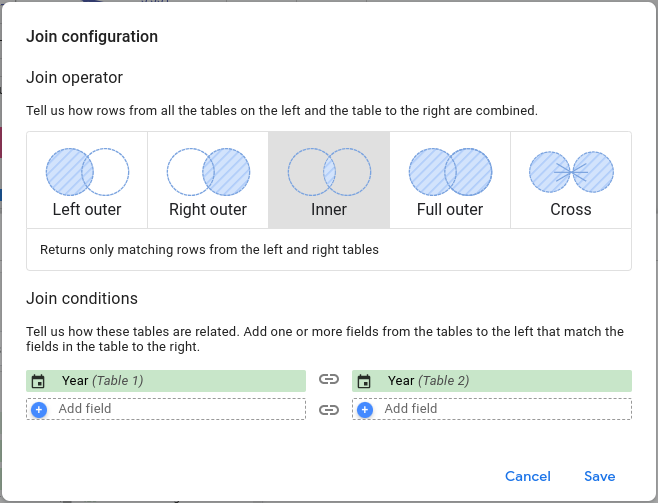

**Dimension** names are deceptive. Just because they have the same name both in GA4 and Ads, it does not mean they follow the same convention of data formatting. To blend successfully, you have to make sure both **Dimensions** have the same data format. Watch out for source data granularity.

Quite some time has passed since my [last entry](/google-data-studio-and-ga4-recreating-the-month-of-year-dimension-properly) on a similar topic. So much time, that Google Data Studio has renamed itself. This time I will be looking at data blending from Google Ads with GA4 using time-based **Dimensions**.

In order to successfully blend data from GA4 and Ads, while keeping a meaningful intersection (this means using Left / Right outer join, or Inner join), we naturally need to apply a meaningful Join condition - a set of compatible fields that will be shared between both source Tables.

At first glance this seems like a sensible assumption, however, I have ran into surprising issues. Let's have a look at a specific example: Joining Tables using dimension **Year**.

The left table is from Google Analytics 4 and right table from Google Ads. A simple relationship with two same dimensions provided by two systems from the same company. What could go wrong?

I have ended up with *User Configuration Error* after finishing this setup of Blended data.  The error description - a cryptic line: *This data source was improperly configured.*

So what went wrong? While technically storing the same data - both **Year** dimensions have a different formatting. Let's introduce a new term and call this formatting **Native formatting**. Unless two dimensions have the same Native formatting - they cannot be used to blend data successfully, even if they supposedly store the same type of information with the same granularity.

It is possible to reveal the Native formatting by using the `CAST(Dimension AS TEXT)` function and displaying the result in a Table chart. The following table lists key time-based Dimensions from Google Ads and Analytics 4 with value examples.

| **Data source** | **Dimension** | **Granularity** | **CAST() example values** | **Compatible dimensions** |
| --- | --- | --- | --- | --- |
| Google Analytics 4 | **Year** | Year | 2023-01-01 / 2024-01-01 / 2025-01-01 | N/A |
| Google Ads | **Year** | Year | 2023 / 2024 / 2025 | N/A |
| Google Analytics 4 | **Month** | Month | 1 / 2 / 3 | N/A |
| Google Ads | **Month** | Month | 2023-01-01 / 2023-02-01 / 2023-03-01 | **GA4: Year month** |
| Google Analytics 4 | **Year month** | Month | 2023-01-01 / 2023-02-01 / 2023-03-01 | **Ads: Month** |
| Google Analytics 4 | **Date** | Day | 2023-01-01 / 2023-01-02 / 2023-01-03 | **Ads: Day** |
| Google Ads | **Day** | Day | 2023-01-01 / 2023-01-02 / 2023-01-03 | **GA4: Date** |

**Table 1:** Most common time-based dimensions and their Native formatting in Google Ads and Analytics 4. Including information which dimensions are compatible.

This reveals that **Year** dimension from Google Ads is not compatible with **Year** dimension from Google Analytics. From the first glance it could be tempting to use **GA4: Year** with **Ads: Month** or **Ads: Day** but that would be a bad idea: they do not preserve the same data granularity. Meaning: that Metrics data from one system would be aggregated into sets of different size than data from the second system. This could lead to incorrect numbers in Looker studio Charts. It is, in fact, exactly the same situation as described in my older [article on Google Data Studio](/google-data-studio-and-ga4-recreating-the-month-of-year-dimension-properly).

The takeaway: If we need a low granularity based upon years - Google does not provide us with two compatible Dimensions. The solution: build a new field using functions that will convert both **Year** dimensions into a compatible format. The format has to be exactly the same: the same value representation and same data type. This is best achieved if we create a new field in both source tables.

Let's introduce a new dimension and call it **Just year**. The formula for Google Analytics 4 would be: `SUBSTR(Year, 1, 4)` and for Google Ads: `CAST(Year AS TEXT)`. This means both fields won't be even treated as time-based values, only as a simple text. This isn't a problem, they will only provide relationship between the two data sets. We can always use the real dimensions called **Year** to plot our Charts.
